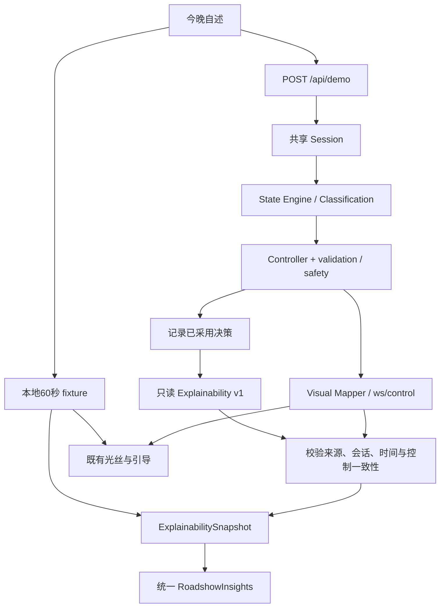

# Explainability Contract v1 — Phase 5

## 审查基线

本阶段从 `origin/main` **5e29d73584d7b0c9cd917340e2f9e5f24aef78ac** 开始，已包含队友 `feat: add roadshow decision replay and dual-layer visuals`。保留双层 FilamentLife、海浪、中文引导、60 秒轨迹、控制连接、manual、lab 与传感器代码。

改动前：State Engine / Classification 已产生 state_class、confidence、reason_codes；Controller 已返回统一验证后的 RitualDecision。`/ws/state` 包含完整 State 和 Ritual；`/ws/control` 的 debug state 只有 arousal/stability/trend，guidance 没有 action/reason。首页决策窗口直接读取 `PERSONAL_REFERENCE / ROADSHOW_DECISIONS / roadshowDecisionAt / roadshowSignals`，完整解释仅是前端 presentation fixture。真实后端窗口只显示引导文字。

本阶段补齐只读决策投影、真实执行来源、模拟近期历史、今晚状态选择、体验前总览，以及 demo/backend 共用的解释显示层。没有新增分类器、治疗动作或正式数据库。

## 来源边界

| 类别 | 本阶段内容 | 不应声称 |
|---|---|---|
| REAL BACKEND | State Engine 输出、实际采用的 RitualDecision、决策来源、决策历史、实际 consumed signals | 不等于使用真实传感器；默认仍是 Simulator |
| DEMO FIXTURE | 本地 60 秒轨迹、预设分类/理由、心率 72–80 / 呼吸 12–16、最近 7 次 arousal/stability | 不是真实历史、真实改善或外部 LLM 生成 |
| PRESENTATION COPY | 动作中文名、reason_code 中文翻译、流程说明、conditional_note、结束语 | 不是内部思考，也不是新增 Controller 策略 |
| FUTURE SENSOR | 保留 Sensor Adapter、PPG prototype、Apple Watch adapter/docs、mixed interface | 未作为主 Roadshow 必经步骤；本轮未优化或实测硬件 |

DEMO 标签固定为「模拟案例 · 决策回放」。本地 fixture 的 `decision_source=null`，不冒称 rule/mock_llm/llm 执行。回放的 `confidence=0` 是未计算占位，UI 显示「未计算（回放）」。真实 State Engine 的 confidence 是规则证据覆盖与一致性，不是临床概率。

## API 与读取语义

- `GET /api/explainability` → ExplainabilitySnapshot，`version="1.0"`。
- `GET /api/schema/explainability` → JSON Schema，与 [explainability.schema.json](explainability.schema.json) 一致。
- [explainability.example.json](explainability.example.json) 是实际 Python Session 的 `not_responding` 场景第 39 秒输出，可由测试复现；是 **真实后端执行 + 模拟信号**。
- 保持 `/ws/control` v2.0 与 `/ws/state` v1.1 原有 wire shape。

GET **不调用** current_frame、StateEngine.update 或 Controller.decide，不推进时间、不采样、不消费 v2 seq、不发起模型调用。Session 在采用决策的同一 tick 记录 trace。尚未有 WebSocket 驱动的 tick 时返回 pending：timestamp/current_state/initial_state/decision_trace/response 为 null，history 为空；不虚构当前状态。现有 WebSocket 消费者共同驱动懒执行 runtime。

`scope=shared_process`：当前后端是一个进程内共享演示会话，**不是多用户独立账户会话**。`POST /api/demo` 会重置共享会话、取消旧 LLM pending、创建新 session_id，并清空解释历史和初始方案。GET 不重置任何会话。每次 reset 的隔离不等于提供了正式多租户隔离。

## 字段

| 字段 | 含义 |
|---|---|
| version | 固定 `1.0` |
| session_id | 与同一 Session 的 `/ws/control` 一致 |
| timestamp | 最后实际计算 frame 的 Unix 秒；不是接口读取时间，pending 为 null |
| session_second | 当前 Session 已执行的 tick；pending 为 null |
| scope | 后端 `shared_process`，本地回放 `local_replay` |
| self_report | mind_racing / body_tense / tired_but_awake / already_sleepy |
| provenance.data_source | **被 State Engine 消费的**读数来源：simulated/mixed/sensor/unknown |
| provenance.baseline_source | 固定 `simulated_demo_history`，即便信号是 mixed 也不改成真实历史 |
| provenance.decision_source | 最终采用的 rule/mock_llm/llm；pending 或本地预设回放为 null |
| provenance.explanation_source | backend 或 demo_fixture |
| baseline | 7 条确定性模拟 history，以及均值 arousal=.46、stability=.67 |
| session_signal_baseline | State Engine 的本次 HR/respiration 参考；未建立前 null；与近期 history 严格分开 |
| current_state | 实际 Frame.state，包含六项可解释字段 |
| initial_state | pending 后的初始自述先验；信号参考完成时固定为首个已建立参考的 State |
| tonight_plan.initial_decision | 首次非 assess 的实际 RitualDecision；未决定前 null；后续保留 |
| tonight_plan.reassessment_interval_sec | 后端实际 ControllerConfig.decision_seconds（默认30）；本地案例首次观察节点22 |
| tonight_plan.conditional_note | 对支持行为的条件性产品说明，不是 LLM 生成计划或承诺下一动作 |
| decision_trace | 最新实际采用的决策与当时 observation、State、decision_source |
| decision_trace.at | 采用该决策的会话秒数 |
| decision_trace.decision | 原样 RitualDecision：stage/action/inhale_sec/exhale_sec/visual_intensity/audio_intensity/message/reason |
| decision_trace.next_reassessment_sec | 会话内下一判断点提示；baseline pending 时下一采样 tick；fade/end 为 null。安全事件仍可立即抢占 |
| decision_history | 发生判断窗口、阶段/动作改变或执行来源改变时的记录，最多32条；不是完整逐秒日志 |
| response | 与 initial_state 的 arousal/stability 差值；baseline pending 时 null；observation_only=true，不作疗效归因 |

当前信号显示可能被 sensor adapter 的同秒新输入刷新；trace.observation 始终保留**实际进入引擎的**读数，不把后来的新值回填到旧判断中。`/api/sensor/status` 的 live 来源可能与 consumed 来源不同。

## 决策来源

`LLMController.last_source` 继续保留旧的 pending/fallback/safety 调试语义，新增 `executed_source` 表示实际执行：

| 执行路径 | decision_source |
|---|---|
| RuleBasedController | rule |
| LLM pending / timeout / invalid / missing config / 当前状态复验失败 | rule |
| discomfort / ready guard / sleepy short path / fade / end 等规则安全路径 | rule |
| MockLLMProvider 返回且通过验证、当前状态复验、最终被采用 | mock_llm |
| 外部 provider 返回且通过同样校验、最终被采用 | llm |

Mock provider 按实际 provider 类型识别，不能仅因配置 mode=llm 就显示 llm。`successes` 计数不代表结果已采用，UI 不用该计数判定来源。接口不暴露提示词、原始模型输出、秘钥或内部思考。

## 前端数据流

`roadshow-insights.tsx` 不再导入 roadshow-demo，不生成分类或决策。展示快照，曲线 rows/reference 由上层适配器提供。

`use-explainability.ts` 每次请求完成后等待750ms再请求，4秒超时；离开 backend、断线或 session_id 改变时 abort、清空并拒绝旧响应。`matchesControl` 只接受 backend/shared_process，与 v2 session_id、时间、stage/timings/message 以及存在的 debug state 一致的解释。旧会话、错误版本、断线、HTTP失败或不匹配时显示暂无，不套用 demo。v1 仍可驱动原有视觉；由于没有 session_id，完整解释面板只与 v2 配对。

终止后的决策 timestamp 不再推进；在同一会话仍收到新鲜且一致的 terminal ControlFrame 时保留最终解释。socket 过期或断开后清空。

连接区区分「查看现有后端会话」（不重置）和「以今晚状态开始后端会话」（显式 POST reset）。HTTP URL 从可信 WS 地址派生，保留部署路径前缀；线上使用 HTTPS/WSS。后端 `CORS_ORIGINS` 需允许前端实际 origin，并保留 GET/POST/Content-Type。没有自动使用其他服务器或模拟解释来掩盖失败。

## 验收边界

自动测试覆盖 schema 与 example 一致、确定性 baseline 和来源、State/RitualDecision 投影、rule/mock/LLM 成功及 fallback、readonly、reset、discomfort、双 WebSocket 回归；前端覆盖状态变体、完整回放、节点切换、暂停/恢复/重播、来源/时间/会话匹配、Python example 被 Zod 接受，以及实际 React 组件的服务器渲染输出。

生产 build 与 typecheck 必须运行。浏览器真实点击、中文音色、WebGL性能、窄屏视觉和线上 CORS/网络联调仍需实机验收：本次云端预览基础设施不可用，不能把服务器渲染测试称为浏览器 E2E。真实付费外部 LLM 调用、手机 PPG / Apple Watch 硬件没有实测；HTTP provider 路径用 MockTransport 验证成功与校验行为。
